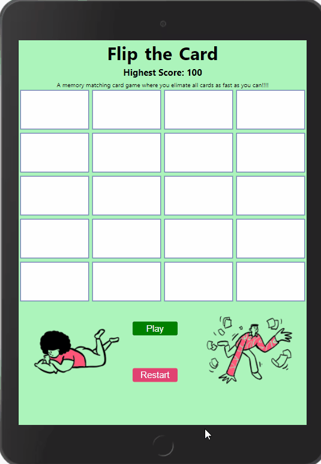
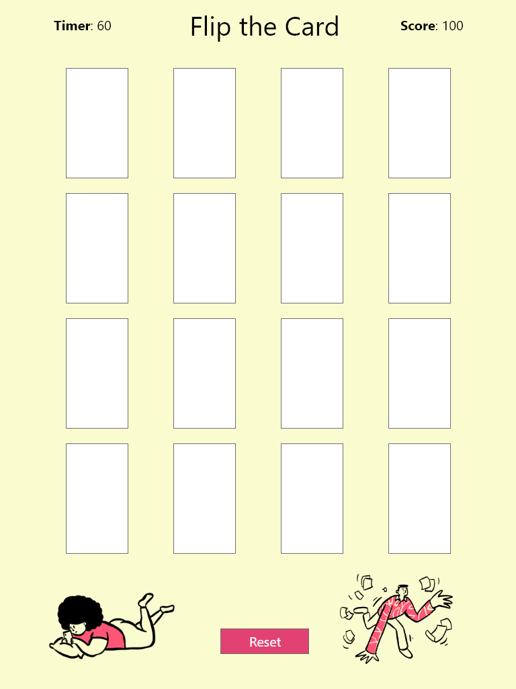
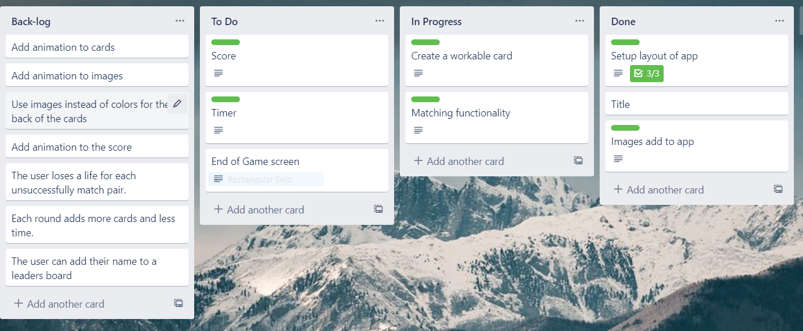

# Flip a Card

### Table of Contents

1. Project Demo Link
2. Purpose
3. Motivation
4. Wireframe
5. How to play
6. Technologies Used

### Project Demo Link: [Flip a Card](https://jcsmiley-flip-a-card.netlify.app/)

### Purpose:

A React web game where the user race against time to match unturned cards.

### Motivation:

The goal was to build a capstone project along side my students in the Launch Code tech boot-camp. This meant:
1. Pre-planning with hi-fi wire-framing using Adobe XD
2. Using Trello for task management
3. Creating user stories to help plan tasks and determing what into the MVP, alpha, and beta app
4. Accessibility enhancements (Using images, colors, and etc. to show a choice, keyboard navigation and playability, HTML semantics, includes roles and aria-labels)
5. Intentional breaking the code into smaller components.

### WireFrame

#### Trello

### How to play:

- The player have to press the start button to start the timer and game
- The player will click on a card to flip it and show it's image
- The player goal is to find two matching cards
- The player has 60 seconds in a regular game and 45 secons in challenge mode to find all 10 sets of cards

### This app was built with the following technologies:

**React:** JavaScript front-end library for building user interfaces

**Netlify**: Web developer platform for hosting infrastructure, continuous integration, deployment pipeline with GitHub, and serverless backend services.

**Git-Hub:** Web-based version control repository and Internet hosting service

**Abode XD** A wire-framing tool used to create a mockup/visual of what is to be coded

**JavaScript:** Object-oriented programming language for web pages

**HTML:** Mark-up language for creating web pages

**CSS:** A formatting language for styling web pages

_Updated by JC Smiley in May of 2021_